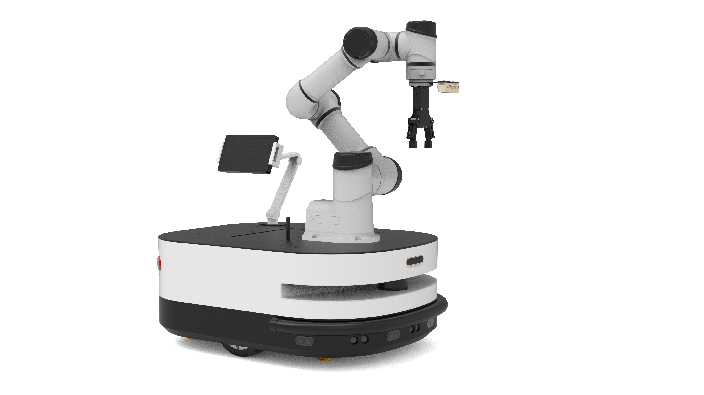
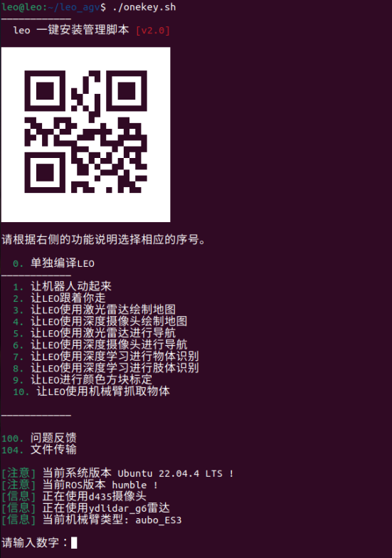
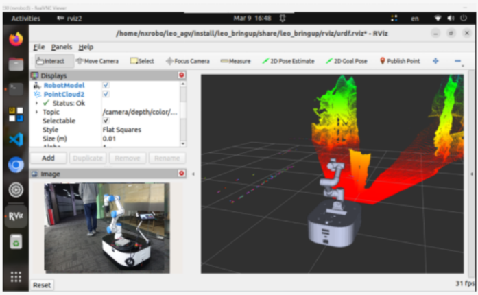
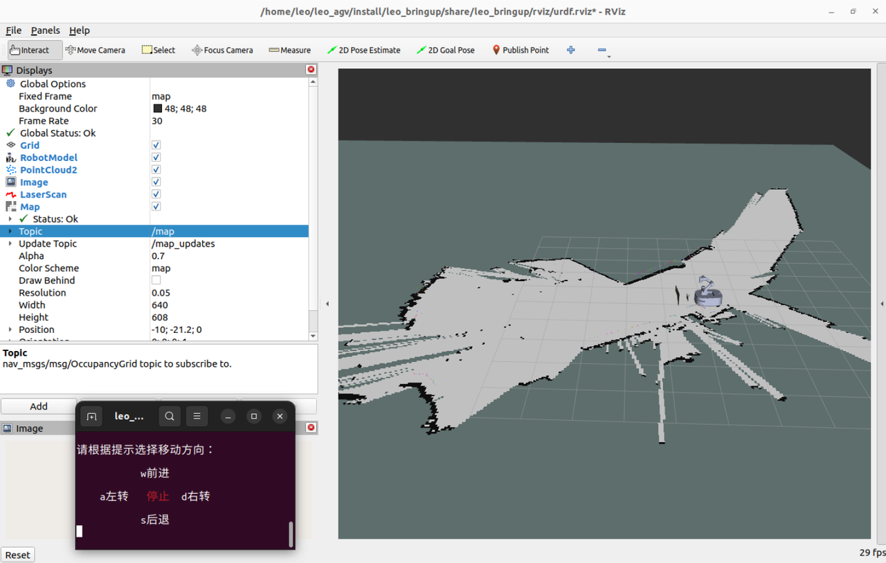
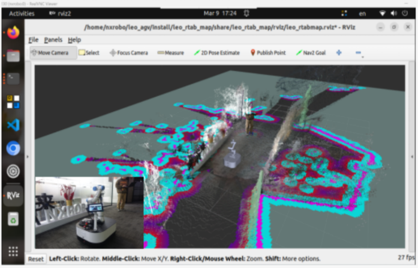
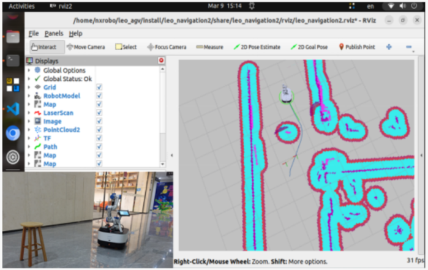

# NXROBO Leo



# 列表 Table of Contents

- [功能包说明 packages-overview](#功能包说明 packages-overview)
- [使用 usage](#使用 usage)
- [功能展示 Function Display](#功能展示 Function Display)

# 功能包说明 packages-overview

- **src** : Leo的源代码，包括底层配置，硬件驱动，和各个应用功能包等。
- **doc** : 驱动安装脚本文件。

# 使用 usage

### 系统要求 Prequirement

- System: Ubuntu 22.04+
- ROS Version: Humble (Desktop-Full Install)

### **下载安装** Download and install

- 下载工作空间 Download the workspace:

```shell
git clone https://github.com/NXROBO/leo_agv.git
```

### **编译运行** Build and run

```shell
cd leo_agv
colcon build
```

- 如果编译一切正常，可根据提示运行相关例程。If everything goes fine, test the examples as follow:

```shell
./onekey.sh
```



# 参数说明 Arguments description

Launch file arguments description

### camera_type_tel

深度摄像头的型号，其对应值如下表。The model type of the depth camera, and the corresponding values can be seen below...

| **Camera** **version** | **CAMERATYPE** **value** |
| ---------------------- | ------------------------ |
| Intel RealSense D435   | "d435"                   |


### RGB

深度摄像头的RGB信息topic，其对应值如下表。The RGB information topic of the depth camera, and the corresponding values can be seen below...

| **Camera** **version** | **depthtolaser** **value**       |
| ---------------------- | -------------------------------- |
| Intel RealSense D435   | "/camera/camera/color/image_raw" |


### Depth

深度摄像头的深度信息topic，其对应值如下表。The depth information topic of the depth camera, and the corresponding values can be seen below...

| **Camera** **version** | **depthtolaser** **value**            |
| ---------------------- | ------------------------------------- |
| Intel RealSense D435   | "/camera/camera/depth/image_rect_raw" |


### lidar_type_tel

激光雷达的型号，其对应值如下表。The model type of the lidar, and the corresponding values can be seen below...

| **Lidar** **version** | **LIDARTYPE** **value** |
| --------------------- | ----------------------- |
| YDLIDAR G6            | "ydlidar_g6"            |


### slam_type

SLAM的算法，其对应值如下表。The algorithm of the SLAM, and the corresponding values can be seen below...

| **SLAM** **algorithm** | **SLAMTYPE** **value** |
| ---------------------- | ---------------------- |
| Gmapping               | "gmapping"             |
| Cartographer           | "cartographer"         |
| slam_toolbox           | "slam_toolbox"         |


### base_type

Leo底盘驱动方式，其对应值如下表。Leo chassis drive mode, and the corresponding values can be seen below...

| Driver mode | **LEO_DRIVER** **value** |
| ----------- | ------------------------ |
| Diff        | "diff"                   |


### arm_type_tel

机械臂的型号，其对应值如下表。The model type of arm, and the corresponding values can be seen below...

| Arm version | **LEO_DEVICE** **value** |
| ----------- | ------------------------ |
| AUBO_ES3    | "aubo_ES3"               |
| None        | "None"                   |


### robot_ip

机械臂的IP地址，其对应值如下表。The ip address of arm, and the corresponding values can be seen below...

| Ip address     | **DEVICE_IP value** |
| -------------- | ------------------- |
| 192.168.47.101 | "192.168.47.101"    |
| None           | "None"              |


# 功能展示 Function Display

**1. Leo 跟随 Leo-Follower**

```shell
cd leo_agv
source install/setup.bash

ros2 launch leo_follower leo_follower.launch.py camera_type_tel:='d435' lidar_type_tel:='ydlidar_g6' base_type:='diff' enable_arm_tel:='true' arm_type_tel:='aubo_ES3' robot_ip:='192.168.47.101'
```

- **camera_type_tel** : 填写对应摄像头型号。 **camera_type_tel** fill in the corresponding camera model
- **lidar_type_tel** : 填写对应激光雷达型号。 **lidar_type_tel** fill in the corresponding LiDAR model
- **base_type** : 填写对应底盘驱动方式。 **base_type** fill in the corresponding chassis drive mode
- **enable_arm_tel** : 是否启动机械臂。 **enable_arm_tel** activate the robotic arm
- **arm_type_tel** : 填写对应机械臂型号。 **arm_type_tel** fill in the corresponding model of the robotic arm
- **robot_ip** : 填写对应机械臂有线IP地址。 **robot_ip** fill in the corresponding IP address of the robotic arm




**2. Leo 2D建图 Leo -SLAM-2DMapping**

```shell
cd leo_agv
source install/setup.bash

ros2 launch leo_slam_transfer start_build_map_gmapping.launch.py camera_type_tel:='d435' lidar_type_tel:='ydlidar_g6'  base_type:='diff' enable_arm_tel:='true' arm_type_tel:='aubo_ES3'  robot_ip:='192.168.47.101' rviz_config:='leo_arm_gmapping.rviz'
```




**3. Leo-RtabMap建图 Leo-RtabMap-Mapping**

```shell
cd leo_agv
source install/setup.bash

ros2 launch leo_rtab_map start_rtabmap_rgbd_sync.launch.py camera_type_tel:='d435' lidar_type_tel:='ydlidar_g6' localization:='false' base_type:='diff' enable_arm_tel:='true' arm_type_tel:='aubo_ES3'  robot_ip:='192.168.47.101' rviz_config:='leo_arm_rtabmap.rviz'
```




**4. Leo导航 Leo-Navigation**

```shell
cd leo_agv
source install/setup.bash

ros2 launch leo_navigation2 start_leo_navigation2.launch.py camera_type_tel:='d435' lidar_type_tel:='ydlidar_g6' base_type:='diff' enable_arm_tel:='true' arm_type_tel:='aubo_ES3'  robot_ip:='192.168.47.101' rviz_config:='leo_arm_navigation2.rviz'
```



